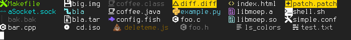

:source-highlighter: pygments
== bestest ls colors
Not just the best, but the bestest (sic!) ls colors - if you make it so.

This program is inspired by https://github.com/mnurzia/even-better-ls[mnurzia/even-better-ls] and aims to offer more customization possibilities. 
For now, the only improvement is being able to have an icon color different from the file name's.

This project does not intend to provide a full color scheme. It's a tool for creating those. Simply edit the source code to do so.

=== Screenshot

=== Requirements

* GNU ls
* Python >= 3.6

=== Installation
Copy `bestest_ls_colors` to `/usr/local/bin` and add the following line to your `~/.bashrc` or whichever shell you use.

[source,bash]
export LS_COLORS=$(bestest_ls_colors)

You can also pipe the output into a file and cat it instead, which makes it more portable.
Make sure to run `ls` with `--color=auto` if you don't see any colors.

=== Similar projects

* https://github.com/trapd00r/LS_COLORS[trapd00r/LS_COLORS] - Provides a full color scheme without icons.
* https://github.com/sharkdp/vivid[sharkdp/vivid] - A similar script that allows config file-based configuration of themes. No icons though.
* https://github.com/athityakumar/colorl[sathityakumar/colorls] - An ls implementation written in Ruby with icon support.
